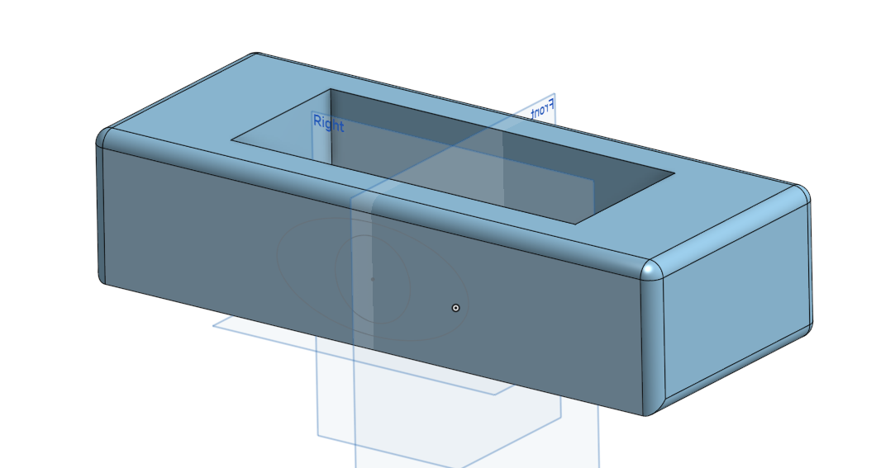

- 추가적인 센서 구매 
진동센서, 사운드센서 구매완료 하였습니다.
(배송은 1월 24일에 시작된다고 하니 25~26일에 도착 예상)

- 화분 3D 모델링 
ssafy에서 사용 가능한 3D프린터 최대 출력 규격이 Width (124.8mm), Depth (70.2mm), Length,(346mm)임으로, 해당 규격을 고려하여 모델링을 진행할 필요가 있습니다.

현재 계획은 외형 모델링, 외형 모델링을 덮을 뚜껑, 화분에서 떨어지는 물을 받을 수 있는 내부 모델링
총 3개가 필요할 것으로 예상됩니다.

01/19일에 추가적인 모델링 조정을 할 예정입니다. 
