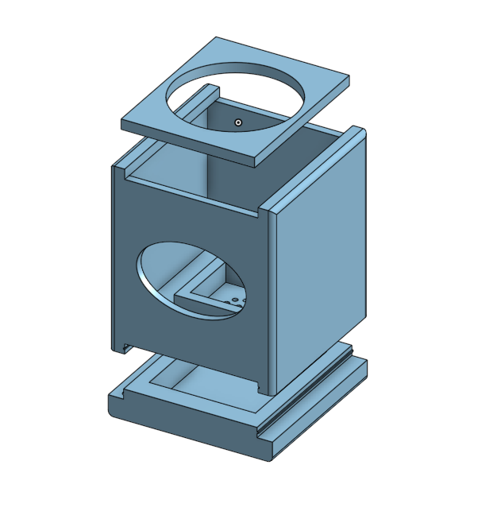

- 화분 3D 모델링 

        대략적인 모델링 외형이 완성이 되었습니다.
        밑에 물이 빠질 수 있게 수정하였고, 모아진 물을 버릴 수 있도록 추가적인 설계를 진행하였습니다. 
        추후 실제 크기의 화분을 구입후, 구체적인 치수가 정해지면 모델링 수정할 예정입니다. 

- IOT 발표자료 준비

        1. 화면 구성 ( 터치 시 ) 
        2. 센서 구성 (스마트 화분 구성)
        3. 예상 모델링 
        4. 전체적인 기능 ( 온습도, 터치, 조도 ) 
        5. 핵심 기능 ( 라즈베리 파이 역할, 아두이노 역할, 웹이랑은 어떻게 통신하는 방법)
        6. 현재 진행 상황
        7. 현재 에러 사항
        8. 향후 계획 

