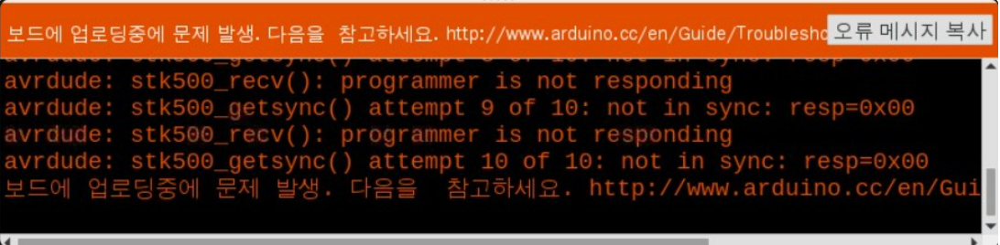

### Today What I do

Trouble shooting
- 아두이노에서 다음과 같은 에러메세지가 발생하는 이유는 아두이노에서 포트를 close하지 않았기 때문
- reset핀을 연결해 지속적으로 아두이노를 재실행하는 방법은 setup()함수를 계속해서 수행하므로 loop()함수가 실행되지 않음
- 따라서, handle_exit() 함수를 사용 (프로그램 종료시 특정 작업을 수행하도록 하는 함수)
참조: https://wikidocs.net/133281
- 해당 함수 내부에 com.close()함수를 수행하도록 하여 아두이노가 정상적으로 포트 종료할 수 있도록 하였고 에러를 수정

