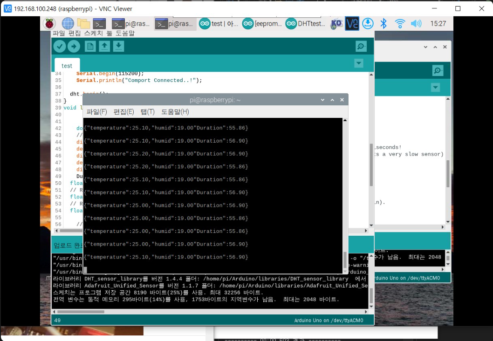

### Today what I do

[Arduino] - C/C++ programming

센서 간 통신 구현

    - 사용 보드 : Arduino Uno, Raspberry Pi 4

    - 사용 센서 : DHT11 , HC-SR04

    - 구현 사항
    
            Serial UART 통신을 통해 Arduino - RPI4 연결.

            Arduino로 Sensor data를 받아 json 타입으로 Parsing
            
            Serial 통신으로 Raspberry Pi가 받은 데이터 출력

플랜토 소개(센서 구성) ppt 제작