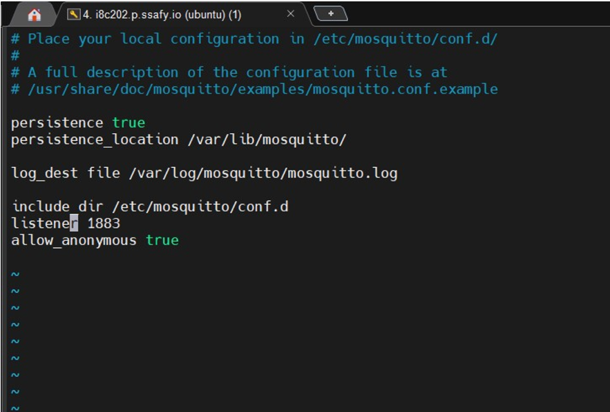
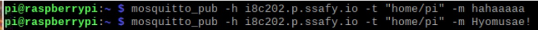
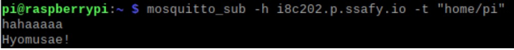

#Today What I do

1. MQTT ERROR

- FIFO /tmp/dlt cannot be opened. Retrying later…
- sudo apt-add-repository --remove ppa:mosquitto-dev/mosquitto-ppa // mqtt삭제
- sudo add-apt-repository ppa:mosquitto-dev/mosquitto-ppa
- sudo apt-get update
- sudo apt install mosquitto

2. couldnot

- sudo rm /var/lib/apt/lists/lock
- sudo rm /var/cache/apt/archives/lock
- sudo rm /var/lib/dpkg/lcok*
- sudo dpkg --configure -a
- sudo apt update

3. 지급받은 AWS계정 mosquitto 설치

1) mosquitto 설치

- sudo add-apt-repository ppa:mosquitto-dev/mosquitto-ppa
- sudo apt-get update
- sudo apt install mosquitto

2) mosquitto.conf 파일 수정

- port 1883 -> listener 1883 변경

3) 1883 port 열기

- sudo ufw allow 1883
- sudo ufw enable

4) Mosquitto pub sub 연결 후 통신

- broker : AWS

- pub

- sub

ip를 적으면 연동이 안되기 때문에 제공받은 값을 그대로 ip값에 기입하니 동작
