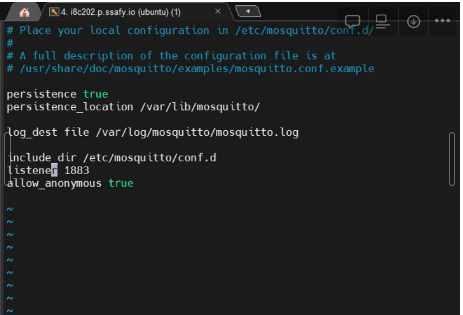
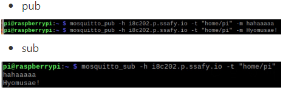

### Today What I DO

1. mosquitto 설치
    
    sudo add-apt-repository ppa:mosquitto-dev/mosquitto-ppa
    sudo apt-get update
    sudo apt install mosquitto
    

2. mosquitto.conf 파일 수정

3. 1883 port 열기
    - sudo ufw allow 1883
    - sudo ufw enable

4. Mosquitto pub sub 연결 후 통신
- pub

## Trouble Shooting

1.FIFO /tmp/dlt cannot be opened. Retrying later… ERROR

2. Could not

- sudo rm /var/lib/apt/lists/lock
- sudo rm /var/cache/apt/archives/lock
- sudo rm /var/lib/dpkg/lcok*
- sudo dpkg --configure -a
- sudo apt update
