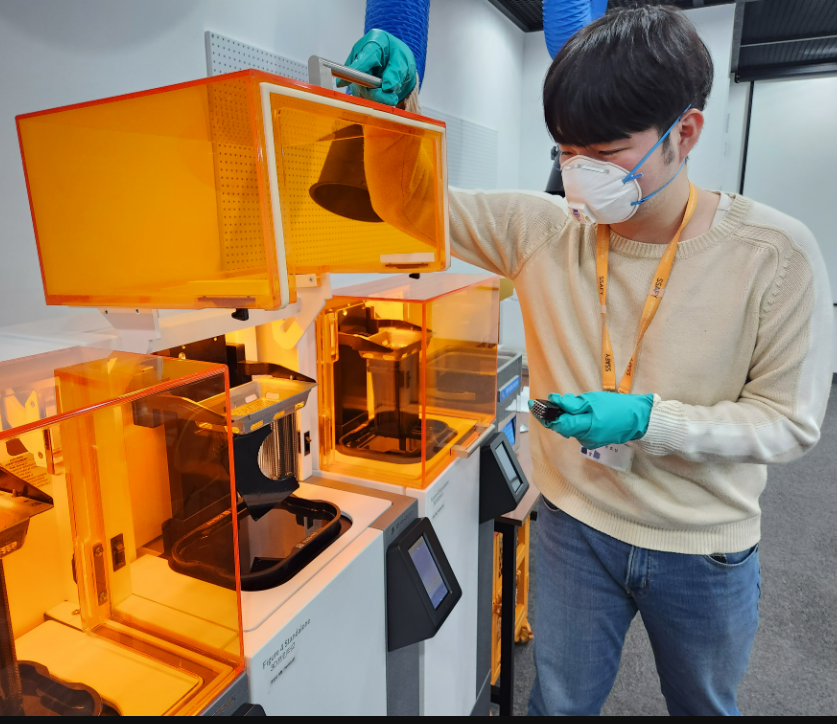
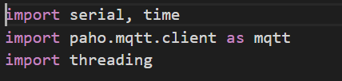
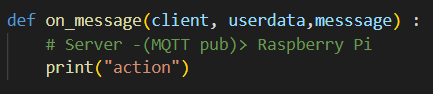
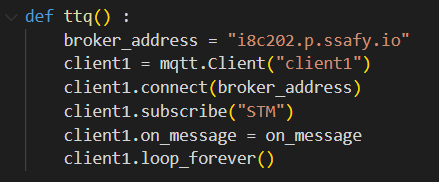
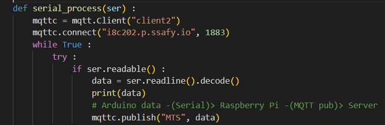

# Today what I do

#### 1. 3D-printing (at. SSAFY)

- 화분 제작을 위해 3D-printing 진행
- Printing 시 기본 (160.0mm * 160.0mm * 150.0mm) 규약이 있기 때문에 화분을 8분할하여 조립식으로 제작
- 모델링한 화분 틀을 .svg 파일로 저장하여 Sprint 툴에 import
- import한 파일을 각각의 3D 프린터기와 연동해 제작 (레진 사용)
- 하나의 틀 제작에 약 2h 30m 소요

#### 2. Python MQTT 및 multi-threading 구현

##### 1) 라이브러리 추가

##### 2) 라이브러리 추가
- 서버에서 들어오는 데이터를 확인하기 위해 on-message() 함수안에 예비구문 실행

- loop_forever() 함수안에서 on_message() 함수가 실행되기 때문에 인터럽트로 활용가능
- STM -> Server to Machine, MTS -> Machine to Server로 MQTT topic 설정
- Raspberry Pi가 Arduino로 부터 센서데이터값을 수신받고, Server로 부터 날씨 데이터를 수신받기 때문에 multi-thread로 동작해야 함

- 센서 데이터값이 try문으로 정상적으로 들어올 경우 publish 진행
- 센서 데이터값이 Server에 저장되어야 하기 때문에 MQTT 통신 구현

