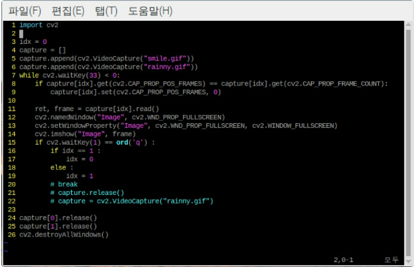
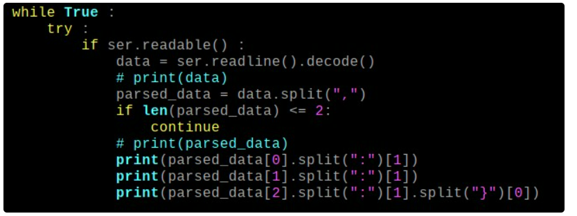
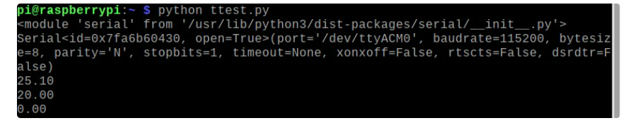

# Today What I Do

## 스마트화분 플랜토 화면 도트 작업

## LCD 모니터에 화면 설계

- 구입한 LCD 모니터를 RPi와 MISI-DSI 인터페이스로 연결
- 연결과정에서 MISI-DSI 인터페이스 버전이 있다는 것을 확인, 제품에 맞는 버전이 존재

- openCV로 .gif파일 수행 (Full-Screen 설계)

- Arduino -> Raspberry Pi 보낸 값 parsing

- 결과값

