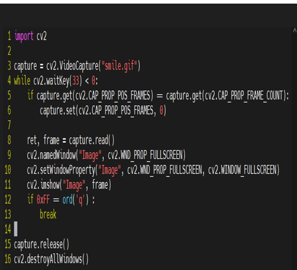
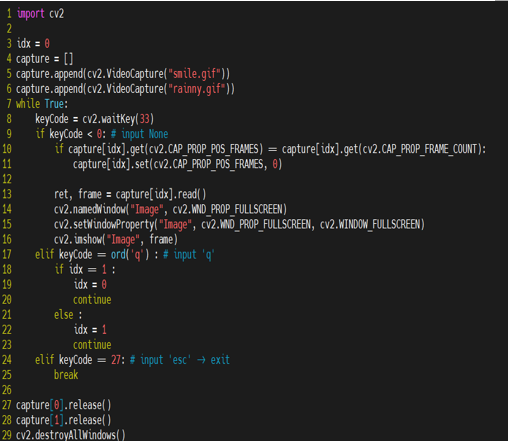

[조건에 따른 영상 바꾸기]

현재 조건에 따라 다른 gif가 출력이 가능하도록 설계 

현재 조건에 따라 다른 gif가 출력이 가능하도록 설계 
1.	while 무한루프로 기본 gif가 계속 출력 
2.	‘q’ 누르면 gif 변경
3.	‘esc’ 누르면 while 탈출 
 

[멀티 스레드 구현하기]
멀티 스레드 사용 이유??
통신, 센서, 영상을 끊기지 않게 계속 받기 위해서는 while 무한루프 사용해야함
여러 개의 while 무한루프 작동시키기 위해서 필요
(모듈화[함수로 만들기]가 필요한 상황)

Threading.Thread(target = 함수).start()
선점형이어서 sleep을 줘서 권한을 줘야함. (크리티컬 섹션 방지)  

[센서 데이터 값에 따라 영상 출력하기]
Serial 스레드
영상 main에서 돌리고 global로 값 받아와서 처리하기 
 

---------------------------추후 진행해야 할 상황-------------------------------------------------------

[멀티스레드]
 / 영상 (출력+전환) - 화면처리 -> 콜백함수 

/ 원재형이 주는 데이터 값을 저장, 날씨 DB 저장할 배열, GIF 만들기 
(Open CV 사용 이유 -- 영상을 이미지로 처리할 수 있어서)

/ 라즈베리파이 – 파이썬
/ 아두이노 - C++ 

[타이머]
만들 프로그램 -> 어떤 기능 -> 현재 : 통신+센서 -> 여러개 센서가 값을 낼건데 -> 센서마다 필요한 대기시간 
-> 센서마다 시간이 다른데 출력은 동시에 해줘야함 그럼 어떻게해야하지 
-> 1초 a 센서는 3번0.3333333 ,b는 2번0.5 c,5번 0.2초마다 전송할거야
-> 특정시간에는 값이 없으니까, thread로 돌리는데  

[객체지향]
파이썬, C++ 의 유사점이 객제지향이라고 생각한다.   

