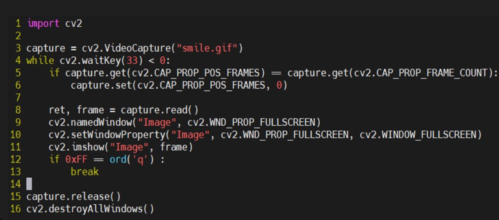
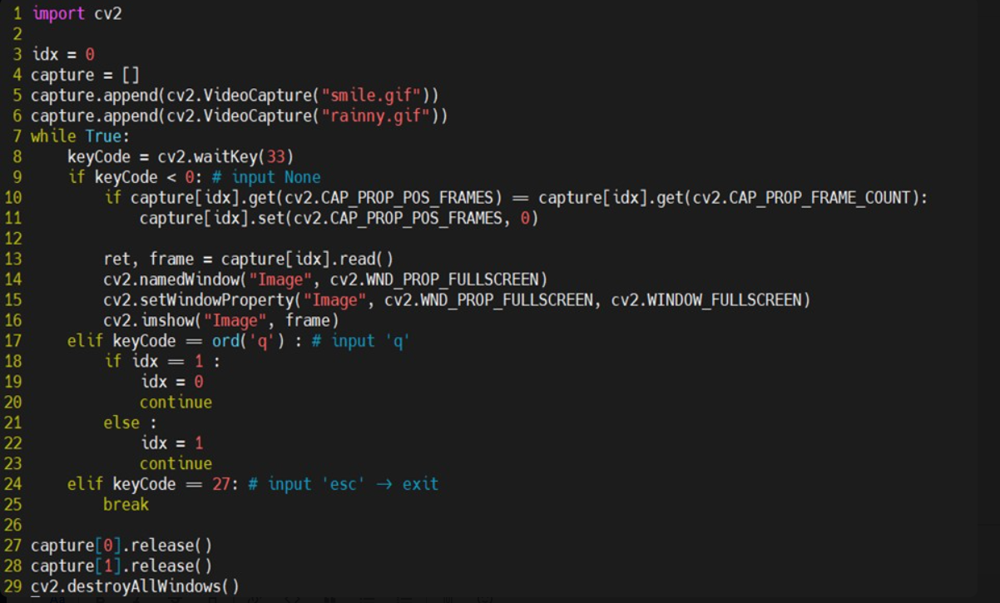
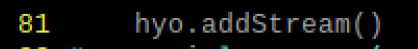
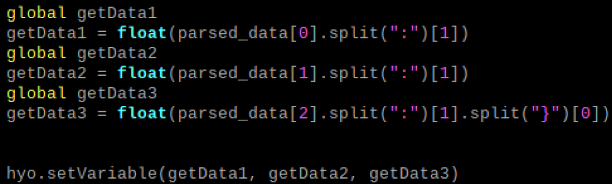
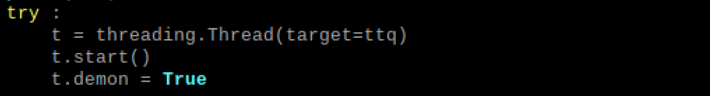
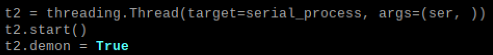

# Today what I do

#### 1. Gif Streamming

###### 기존 코드

- input에 따라 값을 출력 화면을 바꾸려고 하였으나, 문제 발생

##### 수정 코드

- waitKey() 함수의 조건에 따라 input을 처리

- 기존 코드에서 문제점은 입력값이 들어오지 않을 때만 반복문이 동작

- 무한루프로 반복문을 수행한 뒤 조건에 따라 streamming 화면을 변화

- 해당 함수를 해석하는 것이 trouble shooting의 핵심이라 판단

#### 2. 시작화면 설계 & multi-threading

##### 시작화면 설계 (code-level)

- main코드 (ttest.py)에 gif streamming 코드(hyo.py)를 추가하고자 함

- import 하기 위해 테스트 코드를 모듈 단위로 변환

- main코드에 import하고 모듈을 호출하는 방식으로 gif stream

- main코드에서는 Arduino를 통해 들어온 센서 데이터값을 파싱하여 hyo.py 코드로 전달

- hyo.py에서는 받은 값에 따라 streamming을 다르게 진행

##### multi-threading (code-level)

- thread : MQTT(기존)/Rpi to Server, Sensor(현재 추가)/Arduino to Rpi

- main : Gif Stream(추가)
