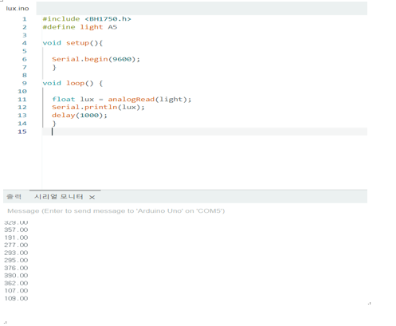
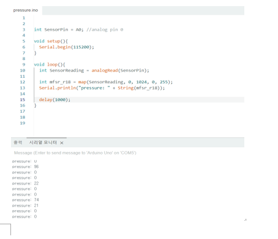

[센서 조정하기]
아날로그센서 구매한 이유 (디지털은 0, 1로 값이 나와서)
 
디지털: 일정 조건 (ex 몇도 이상의 빛)이 들어오면 1
아날로그: 실시간 값 
생 데이터를 보내야함 (MQTT)

 
[확인센서 리스트]

1. 토양습도 센서 ( 흙이 있어야 습도 체크가 가능하니까 현재 패스)

2. 광/조도 센서 모듈

배선

광/ 조도센서는 가릴수록 값이 높아짐 

3. 터치센서

배선

압력 센서의 문제점 : 접지가 원할하지 않아 용접이 필요
	+ 센서가 틀의 두께를 고려하지 못해서 내부가 아닌 외부에 설치 필요 
