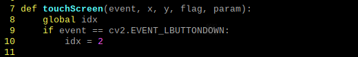

# Today what I do

#### 1. 화면 터치 인터럽트

- 영상 Stream 하는 .py파일 안에 interrupt로 callback될 함수 정의

- OpenCV에서 제공하는 interrupt인 click event를 활용해 터치 인터럽트를 구현

- 마우스 왼쪽 버튼과 LCD터치가 동일한 동작을 수행하기에 조건문을 다음과 같이 구현

- idx 값 변경을 통해 stream 할 gif의 종류를 변경 (test용)

- trouble shooting 과정에서 error가 발생했던 부분

- Callback 함수 실행시, 1번째 parameter에 들어가는 창이 존재해야만 함

- 따라서, imshow를 수행하는 함수 및에 Callback 함수를 실행

#### 2. 마우스 커서 제어

- 최종적으로 LCD display에는 gif 영상만이 출력되어야 함. 따라서, 마우스 커서를 제거

- 터미널에서 커서 제어

- sudo vi /etc/lightdm/lightdm.conf 경로에서 주석 제거 후 -nocursor 옵션 사용
