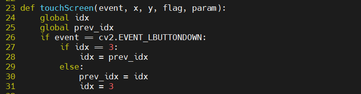

# Today what I do

#### 1. 터치 시 화면 전환 구현

- 기존 터치시 화면 전환 뒤 본래 화면으로 전환이 불가

- 기존 화면으로 돌아가기 위해 전역으로 prev 값을 저장해주고 swap하는 알고리즘을 사용

#### 2. MQTT

- subscirbe 구현

- topic : STM(Server to Machine),  plyload : 날씨 data
