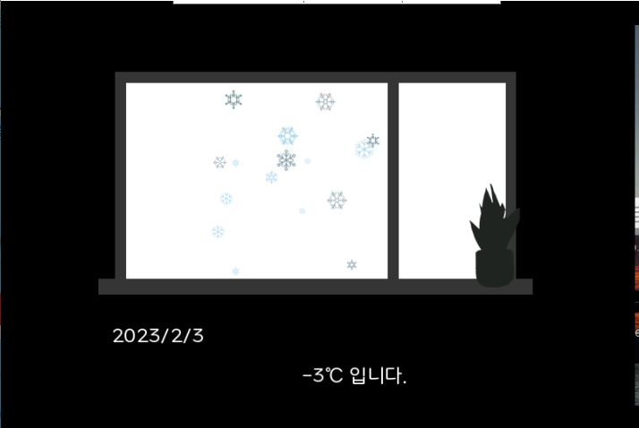
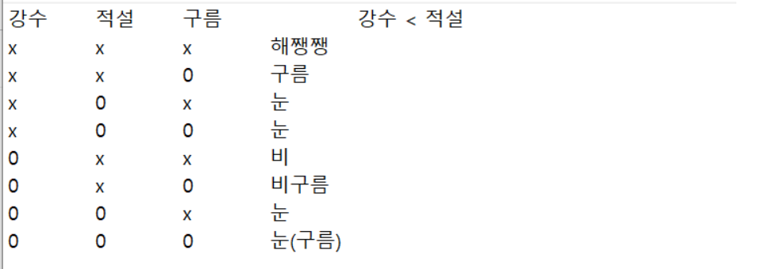
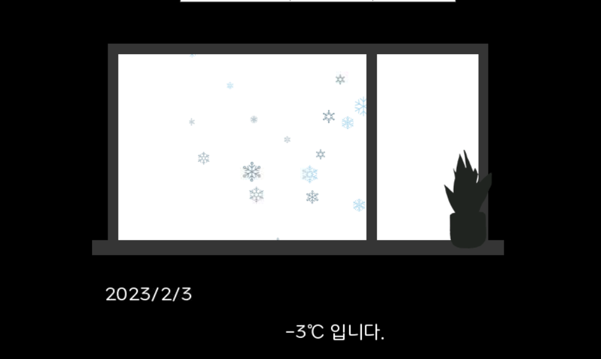

# Today What I Do

## 화분 표정 구현

### 살살 화분의 압력센서 터치시

### 강하게 화분의 압력센서 터치시 

## Gif이미지 내 글씨 삽입

### 삽입 전 jpg 그림

###  삽입 후 jpg 그림

### 날씨화면 내 글씨 삽입

#### 1. 데이터 파싱

- Server로 부터 받은 데이터 파싱

- 현재 날짜 값과 파싱한 데이터가 일치할 경우를 판별

- 파싱한 데이터의 시간값과 현재 시간값이 일치하는 것을 확인할 수 있음

- topic에 맞게 데이터를 추출하는 과정, 구름 데이터를 받아오는 과정 추가 예정

#### 2. 날씨 화면

##### 2-1) 설계

- 받아온 데이터 값에 따라 출력할 화면을 경우의 수에 따라 구분

##### 2-2) 구현

- Test 화면으로 .gif파일에 파싱한 데이터를 text로 추가하는 방식으로 화면 구현

- 구현 단에서 openCV로 한글 지원이 안됨을 파악

- openCV->PIL->openCV 변환을 통해 문제를 해결

- 타입 변환하는 테스트 코드 "ptest2.py" 파일 참조
