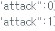
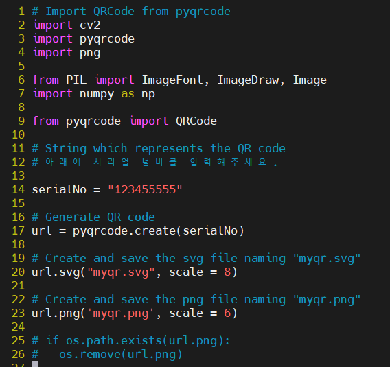
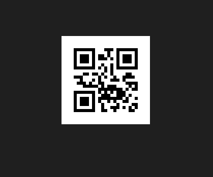

[센서값 파씽]

--------------------------------------------
<라즈베리파이에 그대로 전송할 값>

(temperature) 디지털
초기값 : 값이 크게 뛰지 않음 
변화값 : 값이 크게 뛰지 않음  

(humidity) 디지털 
초기값 : 값이 크게 뛰지 않음  
변화값 : 값이 크게 뛰지 않음 

(light) 아날로그
초기값 :  x < 100 (평상시 75 ~90)
변화값 :  어두워질 때 :  x >100 

(soil-moisture) 아날로그
초기값 : x = 0 
변화값 : 수분 감지시 : x > 0 

----------------------------------------------
<touch 1, 2 값이 변했을 때 값을 파씽>

(touch 1,2) 아날로그
초기값 : x <10
touch = 0;

변화값 
살짝 잡았을 때 : 10 < x < 100
touch = 1;
        
꽉 잡았을 때 : x >= 100
touch = 2;   

--------------------------------------------------
<shock, sound 값이 변했을 때 값을 파씽> 

(shock) 디지털
초기값 : x = 0
변화값 : 터치 시 :  x = 1 (정밀하진 않음)  

(sound) 아날로그
초기값 : x < 20
변화값 : 소리를 냈을 때 : x >= 20  

화분을 안때렸을 때 : attack = 0;
화분을 때렸을 때 : attack = 1;

--------------------------------------------------

[QR코드 생성]

QR코드 생성파일 

완성된 QR코드 
스캔하면 시리얼번호 123455555가 출련된다. 

파일 없으면 만들고 있으면 실행 [덮어쓰기가 가능해서 필요 x]
