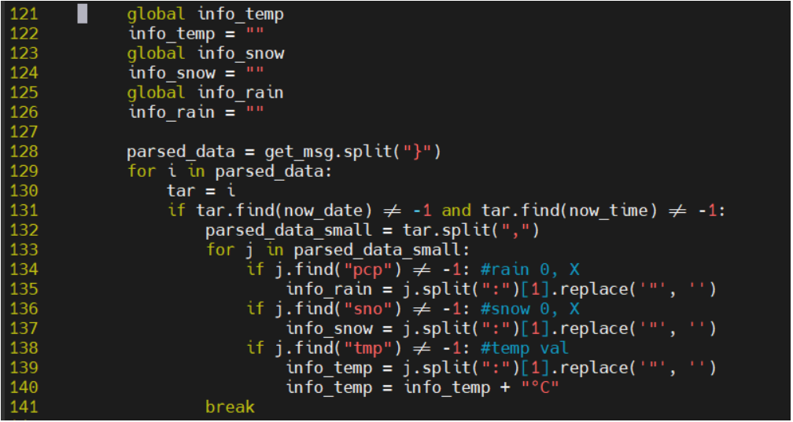
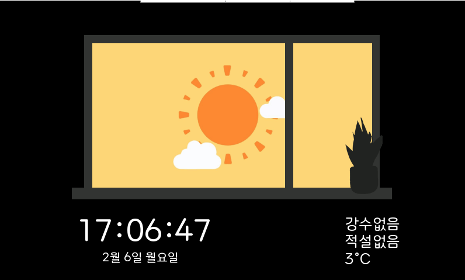
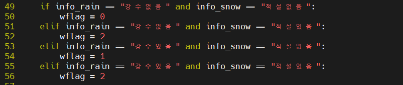
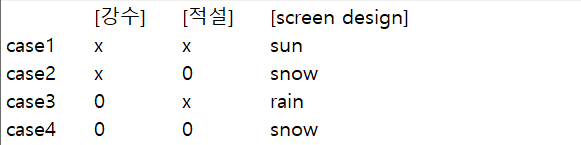
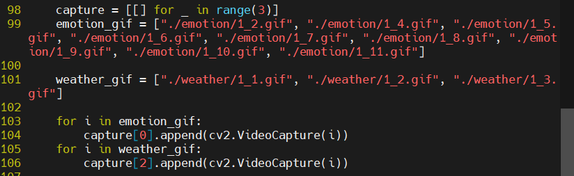
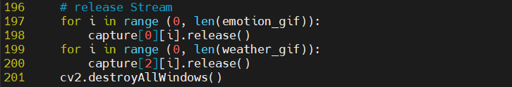

# Today what I do

#### 1. 날씨 데이터 파싱

- 날씨 데이터를 시간별로 1차 파싱

- 1차 파싱한 데이터로 적설, 강수, 온도값 2차 파싱

- 날씨 화면에 현재 시간과 2차 파싱한 값을 표기

- 파싱값에 따라 화면 변동

- touchScreen() 내에 구현하여 인터럽트 발생시 변경하도록 처리

- add: 구름 데이터 값("sky") 0 ~ 2값에 따라 경우의 수 추가하여 화면 구현

#### 2. 날씨 gif 화면 분류

##### Add Stream

##### Release Stream

- 화면을 크게 3가지 category로 분류

- category 변수를 전역으로 사용하여 touchScreen() 인터럽트 발생시 변경할 값으로 사용

- 2차원 배열 생성하여 category(column 값)에 따라 gif 분류

- 0: 일반 표정(emotion), 1: 호감도(미정), 2: 날씨 화면(weather) gif를 저장

- add: 호감도 gif를 만들면 해당 값도 세팅
