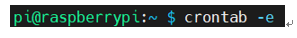
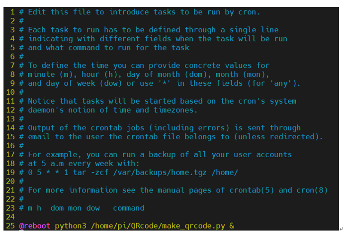

[라즈베리 부팅시 자동으로 파이썬 스크립트 실행]

-> home  앞에 /를 꼭 붙여줘야한다!!!

make_qrcode.py가 라즈베리 부팅시 자동으로 작동

----------------------------------------------------------

[센서값에 따라서 이미지를 바꾸기]

우선순위 
1.(소리/충격) 
2. 터치 
3. 토양습도 
4. 광/조도 
5. 온/습도 

if temperature 변곡점 24.8

if humidity 변곡점 40                

if light 변곡점 100

if soil_moisture 변곡점 10

if touch == 0 { 잡지 않았을 때 }

if touch == 1 { 살짝 잡았을 때 }

if touch == 2 { 꽉 잡았을 때 }

if attack == 0 { 화분을 안때렸을때 }

if attack == 1 { 화븐을 때렸을때 }

