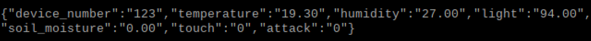
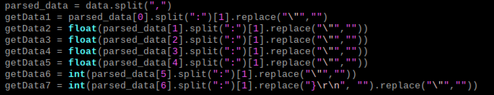
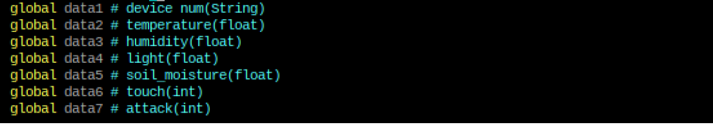
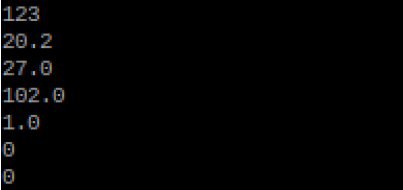
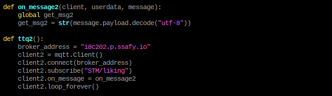

# Today what I do

#### 1. 데이터 파싱

- Arduino -> Raspberry 센서 데이터값 파싱

- 위와 같은 포맷에서 title과 value를 분리하는 과정이 필요

- 파싱한 데이터를 전역변수에 초기화 및 저장

- print시 데이터가 잘 출력되는 것을 확인

- 파싱한 센서 데이터 값에 따라 화면 전환 필요

#### 2. 호감도 데이터 MQTT 통신

- Server -> Rasberry로 들어오는 날씨 데이터 외에 추가적으로 호감도 데이터를 받아올 것

- 날씨 데이터가 loop로 들어오기 때문에 호감도 데이터 역시 thread로 동작하도록 설계

- 날씨 데이터와 더불어 호감도 데이터가 정상적으로 MQTT sub되는 것을 확인
