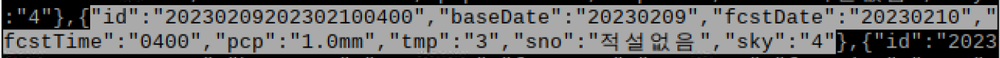
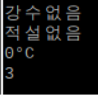
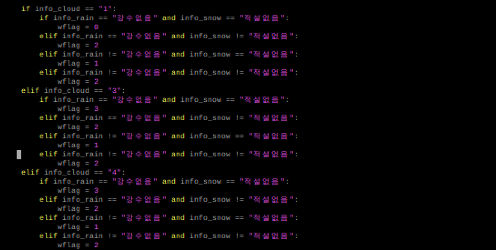

# Today what I do

#### 1. 날씨 데이터 처리

##### 1-1) 파싱

- 추가로 들어오는 "sky"(구름) 데이터 값을 활용하기 위해 파싱

- 기존 파싱값에 추가로 info_cloud 변수만 생성하여 저장

##### 1-2) gif파일 및 날씨 케이스 추가

- 기존 touchScreen() 인터럽트 콜백함수에서 case를 추가

- 새로운 case에 맞는 gif를 출력하기 위해 새로운 gif파일을 리스트에 추가

#### 2. 센서 데이터 처리

- 센서 데이터 값을 받아 그에 맞는 화면을 출력

- 더 많은 경우를 테스트 한 뒤 실제 화분에 부착하는 방식으로 진행할 예정
