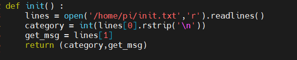
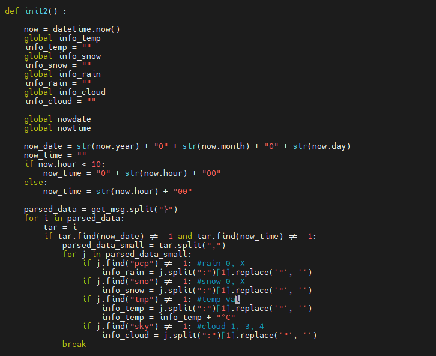
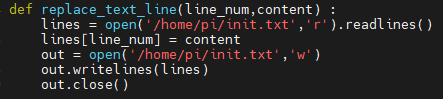
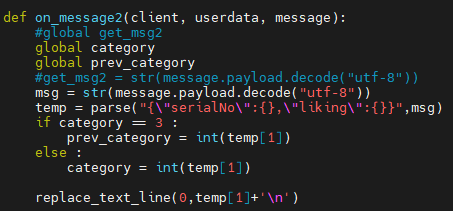

#Today What I Do

## 식물 호감도 및 날씨데이터 파일저장 구현

### 프로그램 실행 시 파일데이터 기반 호감도 초기화

### 프로그램 실행 시 파일데이터 기반 날씨데이터 초기화

## mqtt통신 호감도 및 날씨 데이터 수신 후  파일 저장

### 수신 데이터 저장 함수

### 날씨 데이터 수신 시 저장

### 호감도 데이터 수신 시 저장

참고 코드 : init.py
저장 데이터 : init.txt
