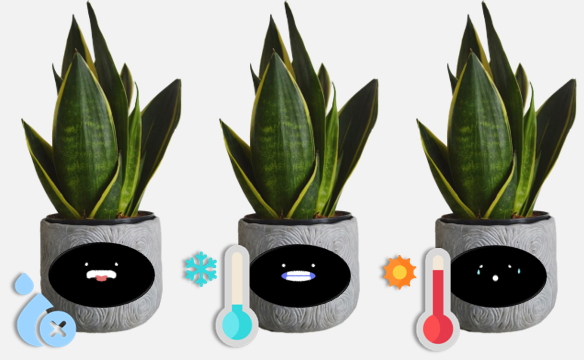

# 스마트 반려화분

#   Planto - 당신 곁의 반려화분

> <h3> 똑똑한 화분, 똑분이

 

## 🪴 **Introduce**

> **Planto**는 센서 데이터 기반으로 반응하는 스마트 화분을 통해 식물과 상호작용하고, 식물의 상태를 관리할 수 있는 IoT 스마트 화분입니다. 
> 단순 상호작용 뿐만 아니라 사용자와 상호작용을 자신의 감정을 표현하고 성장하는 플랜토를 경험해보세요 

 

## 🎥 **소개 영상**
- [UCC 바로가기](https://youtu.be/NvX9HVT-hbI)

 

## 🎥 **실행 영상**
- [Planto 보러가기](https://resisted-barracuda-447.notion.site/Planto-5e6748bbcb7b407ba6080f2777010cb7)

 
## 🕘 **프로젝트 진행 기간**

- **2023.01.09(월) ~ 2023.02.17(금)**

## ☃️ **Team**

<table>
 <tr>
    <td align="center"><a href="https://github.com/HHyos"></td>
    <td align="center"><a href="https://github.com/"></td>
    <td align="center"><a href="https://github.com/"></td>
    <td align="center"><a href="https://github.com/"></td>
    <td align="center"><a href="https://github.com/"></td>
    <td align="center"><a href="https://github.com/"></td>
  </tr>
  <tr>
    <td align="center">팀장, HW</td>
    <td align="center">Frontend</td>
    <td align="center">Backend</td>
    <td align="center">Backend</td>
    <td align="center">HW</td>
    <td align="center">HW</td>
  </tr>
     <tr>
    <td align="center"><a href="https://github.com/"><b>황효상</b></td>
    <td align="center"><a href="https://github.com/"><b>김예은</b></td>
    <td align="center"><a href="https://github.com/"><b>정원재</b></td>
    <td align="center"><a href="https://github.com/"><b>김태영</b></td>
    <td align="center"><a href="https://github.com/"><b>양영진</b></td>
    <td align="center"><a href="https://github.com/"><b>황채연</b></td>
  </tr>

</table>
     
 

## 📍 PPT

- **[중간 발표 PPT](https://drive.google.com/drive/folders/1arW7T25XFIs4wlZCQjDpa6VOl8Ldpun0?usp=sharing)**
- **[최종 발표 PPT](https://drive.google.com/drive/folders/1arW7T25XFIs4wlZCQjDpa6VOl8Ldpun0?usp=sharing)**
  
 

## 🧾 프로젝트 산출물

- [컨벤션](https://www.notion.so/d705551eab504cc196b4208737384345)
- [웹기능](https://www.notion.so/e68b9b75a0344f93a60bfaf7e3d79625)
- [아키텍쳐 설계](https://www.notion.so/1ff26861849c4ec6ac4b9d8a2da33369)
- [포팅메뉴얼/시연시나리오](https://www.notion.so/351a24c618464248942f7d8927ccbe20)
- [데이터베이스 모델링](https://www.notion.so/c94826dbc7124f2a9d75884c9ed8dc3d)
- [기능명세서](https://www.notion.so/85ff5d229c6040d8aa0fd739a491dab6)
- [API 설계](https://www.notion.so/API-82c510571bea4209805aebf98f36cc10)
- [웹 사진](https://www.notion.so/75c66c845f4142e5ab4b5744c0f0f214)

 

## ✔️ 주요 기능

> **반려 화분 Planto**

- **스마트 화분(Planto)**

  - 아두이노, 라즈베리파이로 자체 제작한 스마트 화분
  - 환경 데이터(온도,습도,조도)와 외부 자극(진동, 압력, 소리)를 센서데이터로 입력받음.
  - 데이터를 바탕으로 사용자와 상호작용
  - MQTT통신을 통해 서버와 통신하여 호감도, 날씨 등의 데이터를 주고받고 화면을 통해 표시 가능.

- **데이터 통신**

  - Planto의 센서로부터 입력되는 데이터 수집하여 서버와 통신
  - 날씨, 호감도. 센서데이터 세가지 토픽으로 서버와 통신하고 Serial Number로 유일성 보장
  - 통신 과정에서 수신되는 데이터를 파일로 저장하고, 필요시 사용
  
- **호감도 기능**

  - 호감도 Topic에 대한 레코드로, 서버와 통신
  - 서버에서 Planto에게 호감도 변화 토픽을 수신시 txt파일에 해당 내용을 저장하고, 호감도에 맞는 Planto로 변화

- **상호작용**

  - 현재 환경 데이터(온도,습도,조도)와 외부 자극(압력, 딱콩 등)에 따라 상황에 맞는 화면 표시

- **날씨 표시 기능**

  - 날씨 Topic에 대한 레코드로, 서버와 통신
  - 주기적으로 전송되는 날씨 데이터를 전송받고, 데이터를 변수와 메모장에 저장
  - 프로그램 실행 시, 메모장에 저장된 날씨데이터를 변수에 저장 이후 서버에서 날씨데이터를 수신받으면 해당 데이터로 교체.
  - 사용자가 화면 터치시 데이터에 따른 날씨화면, 정보 및 현재시간 표시. 

 

> **웹** 

- **QR 등록**

  - 카메라를 이용해 화분에 표시된 QR코드를 읽어 등록
  - QR인식 성공시 식물 등록 페이지로 이동

- **식물/화분 상태 확인**

  - 센서데이터를 기반으로 식물의 온도, 습도, 조도 환경 확인
  - 등록한 식물 데이터를 받아와 적합한 생육 환경 확인
  - 식물 입양 날짜 확인 및 교감 데이터를 기반으로 한 호감도 표시

- **필터링 기반 추천**

  - 총 4가지 키워드를 바탕으로 적합한 식물 정보를 제공
  - 어두운 집 / 물 조금만 / 까다로운 / 기르기 쉬운
  - 농사로 API의 정보를 바탕으로 사용자에게 숙련도와 생육 환경에 따른 식물 추천

- **식물 사전 페이지**

  - 사전 페이지를 통해서 식물 세부 관리 환경 표시
  - 농사로 API를 이용한 선호 환경 정보 제공
  - 기능적, 환경적, 추가 관리 정보 slide로 제공

- **업적**
  - 교감 데이터 및 생육 데이터를 기반으로 특정 조건에 따른 업적 리스트 생성
  - 최근 달성한 업적 리스트 표시
  - 업적 달성 시 planto의 표정으로 된 뱃지 획득
  - 뱃지 클릭 시 업적의 세부 내용과 달성 기준 모달로 표시
  - 이용자의 planto 교감 및 지속적인 생육 관심 유도

## &#128215; 아키텍처

    
     

## &#128217; 포팅메뉴얼
    
https://resisted-barracuda-447.notion.site/351a24c618464248942f7d8927ccbe20

## &#128187; 서비스 화면

[ 스마트 화분 ]

### 1. Onboarding

- 플랜토는 전원을 연결하면 초기 화면으로 QR코드를 표시해줍니다. 플랜토 구매 후 첫 부팅시 QR코드를 등록하여 화분과 웹을 연동시킬 수 있습니다.

* 만약 이미 등록된 상태라면 디스플레이를 한번 터치하는것으로 다음 화면으로 넘어갈 수 있습니다.

 

### 2. Interaction

- 플랜토는 1) 온.습도 2) 조도 3) 토양 습도센서 4) 소리 5) 진동 6) 압력 센서의 데이터를 이용하여 감정을 표현, 사용자와 상호작용 합니다.

- 상호작용을 통해 호감도의 상승, 하락이 가능하고, 호감도에 따라 플랜토의 기분이 바뀌니 조심해주세요!

### 3. Display weather information

- 플랜토는 웹과 통신을 통해 실시간 날씨 데이터를 받아와 화면에 표시해줍니다.

 * 날씨 정보가 필요하다면 디스플레이 터치!

 

### [Web]

#### 1. Introduce

 - 웹으로 접속 시 보이는 소개화면
 
 - 화면에 존재하는 QR코드를 통해 Planto 모바일 서비스로 이동
 

#### 2. 메인

 - 카카오 로그인을 통해 회원가입을 할 수 있고, 카카오 로그인 이후 식물 등록 가능
 

#### 3. 식물 사전

 - 농사로 API에 저장되어있는 식물 데이터를 바탕으로 사용자에게 정보를 제공하는 화면
 
 - 식물에게 필요한 조도,습도 등 환경정보를 제공하여 사용자가 식물을 선택할 수 있도록 구현
 

#### 4. 식물 정보 등록

  - Planto 부팅 시 화면에 존재하는 QR코드를 통해 Planto의 고유 Serial Number를 확인하고, 해당 값을 바탕으로 Planto를 앱에 등록하여 통신 시작

#### 5. 식물 정보

  - 현재 로그인되어있는 계정과 연동된 Planto의 정보를 확인할 수 있는 화면
  
  - 센서 데이터를 수집한 환경 데이터와 사용자와 상호작용을 통해 쌓은 호감도를 시각화하여 보여줌
     

     
#### 6. 업적 시스템

 - Planto와 상호작용을 DB에 저장하고, 해당 내용을 바탕으로 업적 달성 시 사용자에게 모달창으로 표시
 

